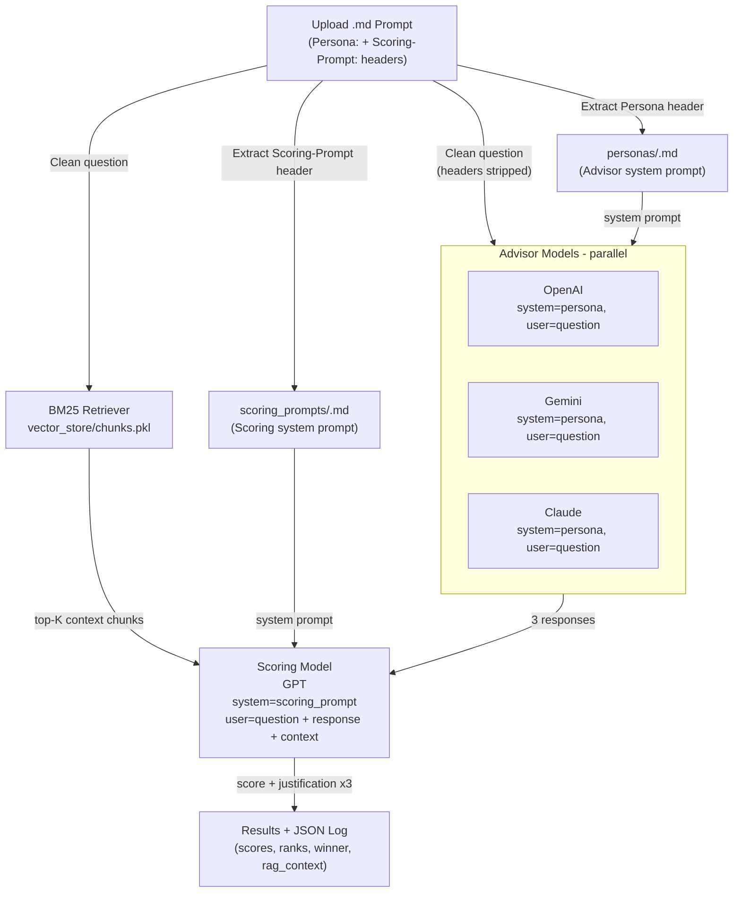

# AiEO Visibility Challenge

**Do the most popular AI models actually know Canada?**

This project investigates whether leading large language models (LLMs) — OpenAI GPT, Google Gemini, and Anthropic Claude — can produce accurate, grounded, and representative answers to questions about life and business in Canada. The current focus is on **starting and operating a business in Canada**.

---

## The Objective

When someone asks an AI "How do I open a coffee shop in Toronto?", do they get an answer that reflects real Canadian regulations, costs, permits, and market realities, or a generic, US-centric response that happens to mention Canada?

This challenge builds an automated pipeline to measure exactly that: **Canadian representability in AI responses**.

---

## How It Works

The pipeline has two stages:

### Stage 1 — The Advisor Models

Three AI models (OpenAI, Gemini, Claude) each play the role of a Canadian business expert. They receive:

- A **role prompt** (`personas/<name>.md`) — behavioural instructions that define the advisor's expertise
- A **user question** — a realistic question someone might ask about starting a business in Canada

All three respond in parallel. We collect their answers.

### Stage 2 — The Scoring Model

A separate GPT model evaluates each advisor's response. To score accurately, it receives:

- A **scoring system prompt** (`scoring_prompts/<name>.md`) — evaluation instructions and criteria
- The **original user question**
- The **advisor's response**
- **Reference context** — relevant chunks retrieved from a local knowledge base using BM25 search (`vector_store/chunks.pkl`), so the scorer can compare answers against real Canadian source material

Each response gets a score (0–100) with a written justification. The three models are ranked and a winner is declared.

---

## Workflow



---

## Project Structure

```bash
AiEO-Visibility-Challenge/
├── app.py                          # Streamlit UI — orchestrates the full pipeline
├── config.py                       # API keys, model names, defaults
├── requirements.txt
├── run.sh                          # One-shot startup script
├── .env.example                    # Environment variable template
│
├── personas/                       # Advisor system prompts (role instructions)
│   ├── canadian_business_startup.md
│   └── educational_counselor.md
│
├── scoring_prompts/                # Scoring model system prompts (evaluation criteria)
│   ├── canadian_business_scoring.md
│   └── educational_counselor_scoring.md
│
├── test_prompts/                   # Sample user question files
│   ├── business_advice_with_persona.md
│   └── education_advice_with_persona.md
│
├── rag/
│   ├── docs/                       # Source documents for the knowledge base
│   ├── ingestion.py                # Chunks and serializes docs into vector_store/
│   └── retrieval.py                # BM25 retriever used at scoring time
│
├── vector_store/
│   └── chunks.pkl                  # Serialized document chunks (built by ingestion.py)
│
└── services/
    ├── llm_service.py              # OpenAI / Gemini / Claude agent classes
    ├── scoring_service.py          # GPT scoring logic with RAG context injection
    ├── file_handler.py             # Parses .md files, loads personas and scoring prompts
    ├── logger_service.py           # JSON log formatting and download
    └── auth_service.py             # Password gate
```

---

## Running It Locally

### 1. Clone and configure

```bash
git clone git@github.com:jluover9000/AiEO-Visibility-Challenge.git
cd AiEO-Visibility-Challenge

cp .env.example .env
```

Open `.env` and fill in your API keys:

```env
OPENAI_API_KEY=your-openai-key-here
GOOGLE_API_KEY=your-google-key-here
ANTHROPIC_API_KEY=your-anthropic-key-here
APP_PASSWORD=choose-a-password
```

### 2. Start the app

The easiest way — one command does everything (creates a venv, installs dependencies, starts the app):

```bash
./run.sh
```

Or manually:

```bash
python3 -m venv venv
source venv/bin/activate
pip install -r requirements.txt
streamlit run app.py
```

### 3. (Optional) Rebuild the knowledge base

If you add new documents to `rag/docs/`, re-run ingestion to update the vector store:

```bash
python rag/ingestion.py
```

### 4. Open the app

Go to **<http://localhost:8501>** in your browser, log in with the password you set, and upload a prompt file from `test_prompts/`.

---

## Writing a Prompt File

Each test prompt is a `.md` file with this format:

```markdown
Persona: canadian_business_startup
Scoring-Prompt: canadian_business_scoring

I want to open a coffee shop in Toronto. What do I need to know to get started?
```

- `Persona:` — references a file in `personas/` (the advisor's role)
- `Scoring-Prompt:` — references a file in `scoring_prompts/` (the evaluator's instructions)
- Everything below the headers is the user question sent to the advisor models

---

## Prerequisites

- Python 3.11+
- API keys for OpenAI, Google Gemini, and Anthropic Claude
