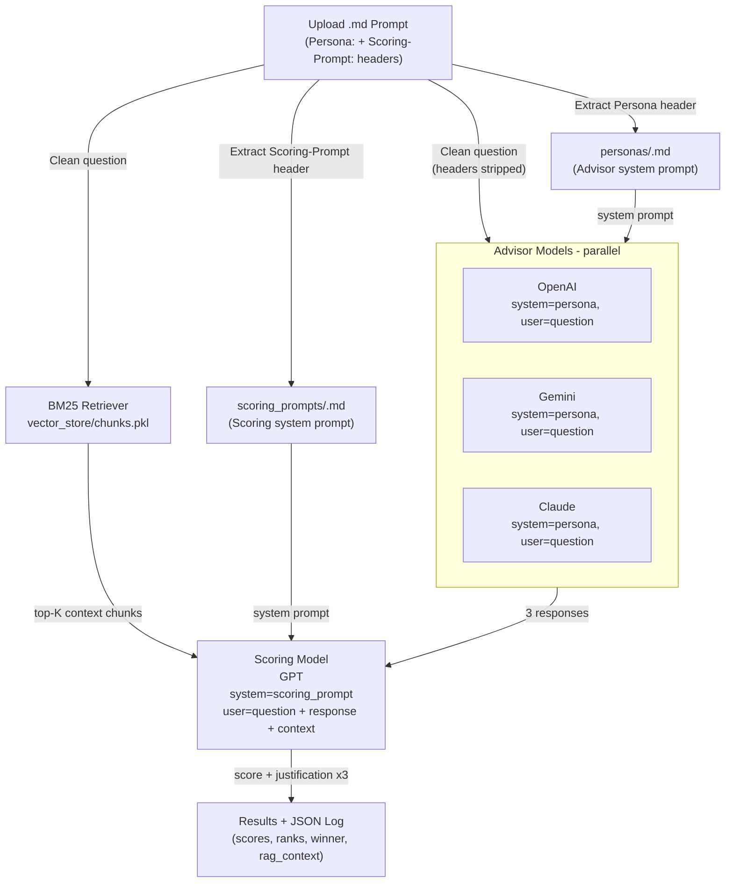

# Multi-LLM Prompt Tester with Automatic Scoring

A Streamlit web application that allows you to test prompts across multiple Large Language Models (OpenAI, Google Gemini, and Anthropic Claude) simultaneously. View real-time streaming responses side-by-side, get automatic AI-powered scoring and ranking, and save results to JSON logs.

## Features

- **Multi-LLM Support**: Test with OpenAI GPT-4, Google Gemini, and Anthropic Claude simultaneously
- **Persona System**: Apply specialized personas (Canadian Business Advisor, Educational Counselor) to shape LLM responses
- **Real-time Streaming**: Watch responses stream in real-time across all three models
- **Automatic Scoring**: AI-powered evaluation and ranking of responses using model-graded scoring
- **RAG-Augmented Scoring**: BM25 retrieval from a local knowledge base injects grounded reference context into the scoring model
- **Winner Detection**: Automatically identifies the best response based on scoring criteria
- **Batch Processing**: Upload multiple .md files and process them all at once
- **JSON Logging**: Save all responses, scores, rankings, and retrieved context as structured JSON
- **Separate Scoring Prompts**: Define evaluation instructions in dedicated `scoring_prompts/<name>.md` files
- **Password Protection**: Simple authentication to control access
- **Comparison Table**: View scores and ranks side-by-side

## Architecture

## Available Personas

The system includes specialized personas that shape how LLMs respond:

- **canadian_business_startup**: Expert business advisor for starting businesses in Canada
- **educational_counselor**: Canadian education and scholarship advisor for students

Personas are optional. Without a persona, LLMs respond in their default mode.

## Prerequisites

- Python 3.11+
- API keys for:
  - OpenAI
  - Google Gemini
  - Anthropic Claude
